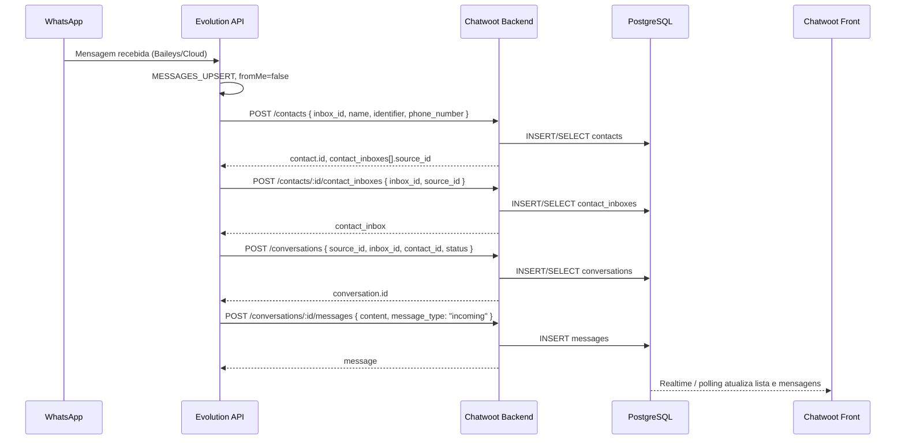
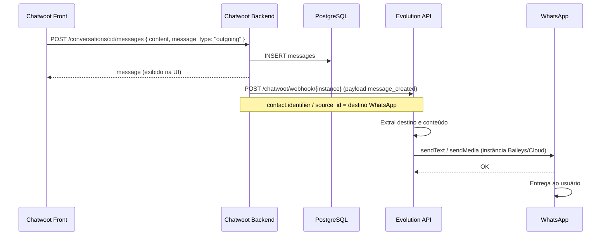

# Análise do Backend Chatwoot e Fluxo Evolution → Chatwoot → Banco → Front

**Data:** 3 de fevereiro de 2026  
**Objetivo:** Explicar a organização do backend do Chatwoot, as regras de separação entre Contato, Conversa, Mensagem, Tag etc., e o fluxo completo com payloads (Evolution → Chatwoot back → banco → Chatwoot front).

---

## 1. Organização do backend Chatwoot

### 1.1 Visão geral das entidades

O Chatwoot (Rails/PostgreSQL) organiza o atendimento em **Account** (conta/tenant), **Inbox** (canal), **Contact**, **ContactInbox**, **Conversation**, **Message** e **Labels/Tags**. A separação é clara:

| Entidade | Papel | Regra principal |
|----------|--------|------------------|
| **Account** | Tenant (uma “empresa” no Chatwoot) | Uma instalação pode ter várias accounts. |
| **Inbox** | Canal de entrada (API, WhatsApp, Email, etc.) | Um account tem vários inboxes. Cada inbox tem `channel_type` (ChannelApi, ChannelWhatsapp, etc.). |
| **Contact** | Identidade do cliente (pessoa/entidade) | **Um por “identidade” no account.** Não é por canal: o mesmo contato pode aparecer em vários inboxes. Campos: `name`, `email`, `phone_number`, `identifier`, `account_id`, `contact_type`, `additional_attributes`, `custom_attributes`. |
| **ContactInbox** | Vínculo contato ↔ inbox (sessão em um canal) | **Um por (contact_id, inbox_id).** Contém o **`source_id`** (string, NOT NULL): identificador único do contato **naquele inbox** (ex.: número WhatsApp, `remoteJid`). UNIQUE(inbox_id, source_id). |
| **Conversation** | Thread de mensagens (uma “conversa” de atendimento) | Pertence a um **contact_inbox**, um **inbox** e um **contact**. Pode haver **várias conversas** por contact_inbox (ex.: reabrir = nova conversa ou mesma reaberta). Campos: `status` (open, pending, resolved), `assignee_id`, `display_id`, `last_activity_at`. |
| **Message** | Uma mensagem dentro de uma conversa | Pertence a uma **conversation**. `sender_type`: "Contact" ou "User" (agente); `sender_id`: contact_id ou user_id; `message_type`: "incoming" (cliente) ou "outgoing" (agente). `source_id` = ID externo da mensagem (ex.: ID da Evolution). |
| **Label / Tag** | Etiqueta para filtrar/organizar | Labels são do **account**. **Conversation** pode ter várias labels (tabela de junção tipo `taggings` ou atributo em conversation). Usado para filtrar conversas (ex.: "vip", "reclamação"). |

Resumo da **regra de ouro**:

- **Contact** = quem é a pessoa (identidade).
- **ContactInbox** = essa pessoa **neste canal**, com `source_id` único naquele inbox.
- **Conversation** = uma thread de atendimento (contact_inbox + inbox + contact).
- **Message** = uma fala na thread; remetente é contact ou user.

---

## 2. Fluxo: Evolution → Chatwoot back → Banco → Chatwoot front

### 2.1 Quem chama quem

- **Evolution → Chatwoot:** A Evolution **chama a API REST do Chatwoot** (com `chatwootUrl`, `chatwootToken`, `chatwootAccountId`) quando recebe eventos do WhatsApp (ex.: mensagem nova).
- **Chatwoot → Evolution:** O Chatwoot **dispara webhook** para a URL configurada no Inbox (callback URL). Essa URL é a da Evolution: `https://evolution.../chatwoot/webhook/{instance}`. A Evolution recebe o POST e envia a mensagem no WhatsApp.

Não há “banco compartilhado” entre Evolution e Chatwoot: o único persistente é o **banco do Chatwoot**. A Evolution é stateless em relação a contatos/conversas; ela só traduz WhatsApp ↔ API Chatwoot.

```
[WhatsApp] ←→ [Evolution API] ←→ [Chatwoot Backend (Rails)] ←→ [PostgreSQL]
                                        ↑                              ↑
                                        │                              │
                                  API REST (Evolution                  Persistência
                                  chama Chatwoot)                      (contacts, contact_inboxes,
                                                                        conversations, messages, labels)
                                        │
                                        ↓
                              [Chatwoot Frontend]
                              (lê via API / Realtime)
```

---

## 3. Fluxo detalhado com payloads

### 3.1 Mensagem recebida no WhatsApp (Evolution → Chatwoot → Banco → Front)

1. **WhatsApp** entrega a mensagem para a instância (Baileys/Cloud) que a **Evolution** controla.
2. A Evolution emite o evento **MESSAGES_UPSERT** (e opcionalmente envia para um webhook global; na integração Chatwoot ela **não depende** desse webhook para enviar ao Chatwoot — ela usa a configuração Chatwoot da instância).
3. **Evolution (lógica interna de integração Chatwoot):**
   - Filtra mensagens **recebidas** (ex.: `fromMe === false`).
   - Extrai: `remoteJid`, nome (pushName), corpo da mensagem, etc.
   - **Chama a API do Chatwoot** na ordem: criar/obter Contact → criar/obter ContactInbox → criar/obter Conversation → criar Message.

**Payload que a Evolution “enxerga” (exemplo típico de MESSAGES_UPSERT no webhook genérico):**

```json
{
  "event": "messages.upsert",
  "instance": "minha-instancia",
  "data": {
    "key": {
      "remoteJid": "5567999999999@s.whatsapp.net",
      "fromMe": false,
      "id": "msg-id-whatsapp"
    },
    "message": {
      "conversation": "Texto da mensagem"
    },
    "messageTimestamp": 1234567890,
    "pushName": "Nome do Contato"
  }
}
```

**Processamento no backend Chatwoot (o que a Evolution chama):**

| Passo | Ação Evolution → Chatwoot | Payload enviado (exemplo) | Resposta Chatwoot (exemplo) |
|-------|----------------------------|---------------------------|-----------------------------|
| 1 | **Criar ou buscar Contact** | `POST /api/v1/accounts/{account_id}/contacts`<br/>Body: `{ "inbox_id": 1, "name": "Nome do Contato", "identifier": "5567999999999@s.whatsapp.net", "phone_number": "+5567999999999", "avatar_url": "..." }` | `200` + payload com `contact.id`, `contact_inboxes[]` com `source_id` |
| 2 | Se não existir **ContactInbox** | `POST /api/v1/accounts/{account_id}/contacts/{contact_id}/contact_inboxes`<br/>Body: `{ "inbox_id": 1, "source_id": "5567999999999@s.whatsapp.net" }` | `200` + contact_inbox |
| 3 | **Criar ou reabrir Conversation** | `POST /api/v1/accounts/{account_id}/conversations`<br/>Body: `{ "source_id": "5567999999999@s.whatsapp.net", "inbox_id": 1, "contact_id": 123, "status": "open" }` (ou "pending" conforme config) | `200` + `{ "id": 456, "account_id": 1, "inbox_id": 1 }` |
| 4 | **Criar Message (incoming)** | `POST /api/v1/accounts/{account_id}/conversations/456/messages`<br/>Body: `{ "content": "Texto da mensagem", "message_type": "incoming", "content_type": "text", "private": false }` | `200` + objeto message (id, content, sender_type: "Contact", etc.) |

O **banco** do Chatwoot persiste: uma linha em `contacts` (ou reutiliza existente), uma em `contact_inboxes` (ou existente), uma em `conversations` (ou reabre), uma em `messages`. O **front** do Chatwoot atualiza via API (polling) ou Realtime (Action Cable/WebSocket) e exibe a nova mensagem na conversa.

---

### 3.2 Mensagem enviada pelo agente (Chatwoot front → Backend → Webhook Evolution → WhatsApp)

1. O **agente** envia mensagem no **Chatwoot front** (UI).
2. O **Chatwoot backend** persiste a mensagem na `conversations` e dispara o **webhook** configurado no Inbox (callback URL).
3. A **callback URL** é a da Evolution: `POST https://evolution.../chatwoot/webhook/{instance}`.
4. A **Evolution** recebe o payload, extrai destino (contact/conversation → source_id / remoteJid) e conteúdo, e envia no WhatsApp (ex.: `sendText`).

**Payload que o Chatwoot envia para a Evolution (webhook message_created):**

```json
{
  "event": "message_created",
  "id": "42",
  "content": "Resposta do atendente",
  "created_at": "2026-02-03T12:00:00Z",
  "message_type": "outgoing",
  "content_type": "text",
  "content_attributes": {},
  "source_id": "5567999999999@s.whatsapp.net",
  "sender": {
    "id": 2,
    "name": "Agente Silva",
    "email": "agente@empresa.com"
  },
  "contact": {
    "id": 123,
    "name": "Nome do Contato",
    "identifier": "5567999999999@s.whatsapp.net"
  },
  "conversation": {
    "id": 456,
    "display_id": 10,
    "inbox_id": 1,
    "additional_attributes": {}
  }
}
```

**Processamento na Evolution:**

- Lê `message_type === "outgoing"` (ou equivalente) para considerar só mensagens do agente.
- Obtém o destino para o WhatsApp a partir de `contact.identifier` ou `source_id` (normaliza para `remoteJid` se necessário).
- Chama a API de envio da instância (ex.: `POST /message/sendText/{instance}`) com número/texto.
- A mensagem já foi salva no Chatwoot pelo backend antes do webhook; o front já pode mostrá-la. O webhook só serve para “replicar” no WhatsApp.

---

## 4. Fluxograma geral (Evolution ↔ Chatwoot back ↔ Banco ↔ Front)

O diagrama abaixo descreve o fluxo de **mensagem recebida** e de **mensagem enviada**, com os payloads e o processamento.

```mermaid
flowchart TB
  subgraph WhatsApp["📱 WhatsApp"]
    WA_USER[Usuário envia mensagem]
    WA_RECV[Usuário recebe mensagem]
  end

  subgraph Evolution["⚙️ Evolution API"]
    EV_CONN[Conexão Baileys/Cloud]
    EV_RECV[Recebe MESSAGES_UPSERT]
    EV_FILTER{Filtra fromMe?}
    EV_CHATWOOT[Integração Chatwoot ativa?]
    EV_CALL_API[Chama API Chatwoot]
    EV_WEBHOOK[Recebe POST /chatwoot/webhook/instance]
    EV_SEND[Envia no WhatsApp sendText/sendMedia]
  end

  subgraph ChatwootBack["🖥️ Chatwoot Backend (Rails)"]
    API_CONTACT[POST /contacts]
    API_CI[POST /contacts/:id/contact_inboxes]
    API_CONV[POST /conversations]
    API_MSG[POST /conversations/:id/messages]
    SAVE_DB[(Persiste no PostgreSQL)]
    WEBHOOK_OUT[Dispara webhook callback URL]
  end

  subgraph ChatwootDB[(PostgreSQL)]
    T_CONTACTS[contacts]
    T_CI[contact_inboxes]
    T_CONV[conversations]
    T_MSG[messages]
    T_LABELS[labels / taggings]
  end

  subgraph ChatwootFront["🖥️ Chatwoot Frontend"]
    UI_LIST[Lista conversas]
    UI_OPEN[Abre conversa / mensagens]
    UI_SEND[Agente envia mensagem]
  end

  WA_USER --> EV_CONN
  EV_CONN --> EV_RECV
  EV_RECV --> EV_FILTER
  EV_FILTER -->|fromMe = false| EV_CHATWOOT
  EV_CHATWOOT -->|Sim| EV_CALL_API
  EV_CALL_API --> API_CONTACT
  API_CONTACT --> SAVE_DB
  SAVE_DB --> T_CONTACTS
  API_CONTACT --> API_CI
  API_CI --> SAVE_DB
  SAVE_DB --> T_CI
  API_CI --> API_CONV
  API_CONV --> SAVE_DB
  SAVE_DB --> T_CONV
  API_CONV --> API_MSG
  API_MSG --> SAVE_DB
  SAVE_DB --> T_MSG
  T_MSG --> UI_OPEN
  T_CONV --> UI_LIST

  UI_SEND --> API_MSG
  API_MSG --> SAVE_DB
  SAVE_DB --> WEBHOOK_OUT
  WEBHOOK_OUT -->|POST payload message_created| EV_WEBHOOK
  EV_WEBHOOK --> EV_SEND
  EV_SEND --> WA_RECV
```

---

## 5. Fluxograma de payloads (recebida vs enviada)

### 5.1 Mensagem recebida (Evolution → Chatwoot → DB)



### 5.2 Mensagem enviada (Front → Chatwoot → Evolution → WhatsApp)



---

## 6. Resumo das regras de separação (Contato vs Conversa vs Mensagem vs Tag)

| Conceito | Onde vive | Regra |
|----------|-----------|--------|
| **Contact** | `contacts` | Uma identidade por cliente no account; identificado por `identifier` (ex.: remoteJid). Pode estar em vários inboxes. |
| **ContactInbox** | `contact_inboxes` | Um registro por (contact, inbox). `source_id` = ID externo **naquele inbox** (ex.: número/remoteJid). UNIQUE(inbox_id, source_id). |
| **Conversation** | `conversations` | Uma thread por contact_inbox (ou várias se reabrir). `status`: open, pending, resolved. Pode ter assignee_id, labels. |
| **Message** | `messages` | Uma linha por mensagem na conversation. `message_type`: incoming (cliente) / outgoing (agente). `sender_type`: Contact ou User. `source_id` = ID externo (ex.: Evolution). |
| **Label/Tag** | `labels` + junção (ex.: taggings) | Labels do account; associadas a conversations para filtrar (ex.: "vip", "reclamação"). |

---

## 7. Referências

- [Evolution API – Integração Chatwoot](https://doc.evolution-api.com/v2/en/integrations/chatwoot)
- [Evolution API – Webhooks](https://doc.evolution-api.com/v2/en/configuration/webhooks)
- [Chatwoot – Create Contact](https://developers.chatwoot.com/api-reference/contacts/create-contact)
- [Chatwoot – Create contact inbox](https://developers.chatwoot.com/api-reference/contacts/create-contact-inbox)
- [Chatwoot – Create New Conversation](https://developers.chatwoot.com/api-reference/conversations/create-new-conversation)
- [Chatwoot – Create New Message](https://developers.chatwoot.com/api-reference/messages/create-new-message)
- [Chatwoot – How to use webhooks](https://www.chatwoot.com/hc/user-guide/articles/1677693021-how-to-use-webhooks)
- Documentos locais: `INVESTIGACAO-CHATWOOT-EVOLUCAO.md`, `chatwoot-evolution-integration.md`, `diferenca-nosso-sistema-vs-chatwoot-evolution.md`
