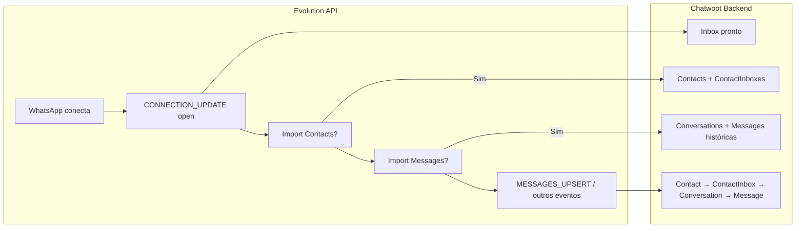
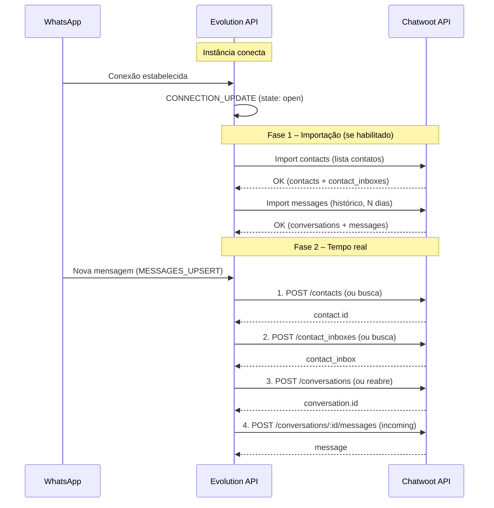

# Chatwoot + Evolution: ordem dos eventos, ranking pós-conexão e fluxograma

Referência da **ordem de processamento** dos eventos que a Evolution envia em direção ao Chatwoot, do **ranking pós-conexão** e da **linha do tempo** Evolution → Chatwoot.

---

## 1. Ordem dos fatores para processamento (Evolution → Chatwoot)

Quando a Evolution recebe um evento do WhatsApp e a integração Chatwoot está ativa, ela **não** repassa o evento bruto. Ela **traduz** o evento em chamadas à API REST do Chatwoot, sempre na mesma ordem de dependência:

| Ordem | Fator | O que a Evolution faz | API Chatwoot chamada |
|-------|--------|------------------------|----------------------|
| **1** | **Contact** | Garante a identidade do cliente (por `identifier` / remoteJid). | `POST /api/v1/accounts/{account_id}/contacts` (ou busca existente). |
| **2** | **ContactInbox** | Garante o vínculo desse contato **neste inbox** com `source_id` único. | `POST /api/v1/accounts/{account_id}/contacts/{contact_id}/contact_inboxes` (inbox_id, source_id). |
| **3** | **Conversation** | Garante uma conversa (thread) para esse contact_inbox; pode reabrir conforme config. | `POST /api/v1/accounts/{account_id}/conversations` (source_id, inbox_id, contact_id, status). |
| **4** | **Message** | Insere a mensagem na conversa (incoming). | `POST /api/v1/accounts/{account_id}/conversations/{id}/messages` (content, message_type: "incoming"). |

**Regra:** a ordem é sempre **Contact → ContactInbox → Conversation → Message**, porque cada passo depende do anterior (contact_id, contact_inbox, conversation_id).

---

## 2. Ranking pós-conexão da instância com o WhatsApp (no Chatwoot)

Após a instância conectar ao WhatsApp (estado “open” / CONNECTION_UPDATE), a Evolution executa as etapas abaixo **nessa ordem** quando a integração Chatwoot está configurada:

| Ranking | Fase | Descrição | Parâmetros relevantes |
|--------|------|-----------|------------------------|
| **1** | **Conexão** | Instância conectada ao WhatsApp (CONNECTION_UPDATE / state open). | — |
| **2** | **Importação de contatos** | Se habilitado, envia a lista de contatos do WhatsApp para o Chatwoot (cria/atualiza Contact + ContactInbox). | `chatwootImportContacts: true` |
| **3** | **Importação de mensagens** | Se habilitado, importa histórico de mensagens até X dias para conversas existentes. | `chatwootImportMessages: true`, `chatwootDaysLimitImportMessages` (ex.: 2 ou 3) |
| **4** | **Tempo real** | A partir daí, cada evento (ex.: MESSAGES_UPSERT) é processado na ordem Contact → ContactInbox → Conversation → Message. | — |

Resumo: **1) Conexão → 2) Import contacts → 3) Import messages → 4) Eventos em tempo real** (sempre na ordem dos fatores do §1).

---

## 3. Fluxograma: linha do tempo do processamento (Evolution → Chatwoot)



### Linha do tempo (sequência)



### Fluxograma detalhado (evento → Chatwoot)

```mermaid
flowchart TB
  subgraph Eventos["Eventos na Evolution"]
    A[MESSAGES_UPSERT]
    B[fromMe = false?]
    C[Integração Chatwoot ativa?]
  end

  subgraph Ordem["Ordem de processamento no Chatwoot"]
    D1["1. Contact\nPOST /contacts"]
    D2["2. ContactInbox\nPOST /contact_inboxes"]
    D3["3. Conversation\nPOST /conversations"]
    D4["4. Message\nPOST /conversations/:id/messages"]
  end

  subgraph DB[(Chatwoot DB)]
    T1[contacts]
    T2[contact_inboxes]
    T3[conversations]
    T4[messages]
  end

  A --> B
  B -->|Sim| C
  C -->|Sim| D1
  D1 --> T1
  D1 --> D2
  D2 --> T2
  D2 --> D3
  D3 --> T3
  D3 --> D4
  D4 --> T4
```

---

## 4. Referências

- [Evolution API – Integração Chatwoot](https://doc.evolution-api.com/v2/en/integrations/chatwoot)
- [Evolution API – Webhooks](https://doc.evolution-api.com/v2/en/configuration/webhooks)
- Doc local: `ANALISE-CHATWOOT-BACKEND-E-FLUXO-EVOLUTION.md` (payloads e sequência detalhada)
- Doc local: `INVESTIGACAO-CHATWOOT-EVOLUCAO.md` (schema e APIs Chatwoot)
