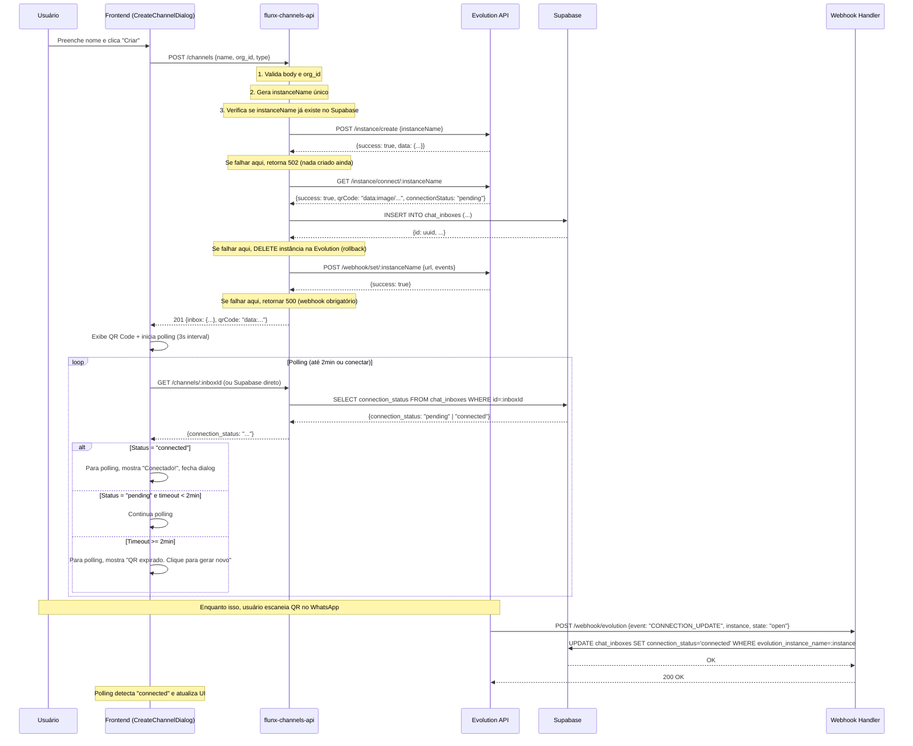

# Flunx-Chat + Evolution: o que implementar e em quantas fases

Documento de resposta com base nos estudos em `flunx-v2/docs`, na análise do código, na consulta direta ao Supabase e nas documentações oficiais da Evolution API v2 e Chatwoot.

**📌 Atualização importante:** Foi adicionada a **Fase 0** após análise profunda do código atual. Embora a criação de canais e conexão QR "funcionem" basicamente, foram identificados **problemas críticos** que impedem o uso em produção (falta de polling, sem tratamento de QR expirado, race conditions, webhook sem autenticação). A Fase 0 documenta o estado atual e propõe correções antes de prosseguir para as Fases 2 e 3.

---

## Fase 0 — Criação de Caixa de Entrada e Conexão WhatsApp (QR Code)

**Status atual:** ✅ **Implementado e corrigido** (Fase 0 concluída — ver seção 0.10)

### 0.1. Contexto e objetivo

Esta fase cobre o fluxo de **criar uma caixa de entrada (inbox)** no Flunx-Chat vinculada a uma **instância da Evolution API** e conectá-la ao WhatsApp via **QR Code**.

**Inspiração (Chatwoot + Evolution):**
- No Chatwoot: usuário cria um "Inbox tipo API" com callback URL
- Na Evolution: cria instância → obtém QR code → escaneia → conecta WhatsApp
- Integração: Evolution configurada com `chatwootUrl`, `chatwootToken`, `chatwootAccountId` para enviar eventos ao Chatwoot

**Nossa abordagem:**
- Não usamos `/chatwoot/set` (não somos Chatwoot)
- Usamos webhook genérico da Evolution (`POST /webhook/set/:instanceName`) apontando para nossa API
- Frontend flunx-chat → flunx-channels-api → Evolution API → WhatsApp

---

### 0.2. Como está hoje (implementação atual)

#### **Fluxo atual (passo a passo):**

1. **Frontend (CreateChannelDialog):**
   - Usuário preenche nome do canal
   - Clica "Criar e gerar QR"
   - `POST ${CHANNELS_API_URL}/channels` com:
     ```json
     {
       "type": "whatsapp_non_official",
       "name": "Atendimento WhatsApp",
       "organization_id": "uuid-da-org"
     }
     ```

2. **Backend (flunx-channels-api/src/index.js):**
   - Valida body
   - Gera `instanceName` único: `${orgSlug}-${nameSlug}-${randomSuffix()}`
   - Chama Evolution `POST /instance/create` com `{ instanceName }`
   - Chama Evolution `GET /instance/connect/:instanceName` → obtém QR code (base64)
   - Salva em `chat_inboxes` (Supabase):
     ```sql
     INSERT INTO chat_inboxes (
       organization_id, name, channel_type,
       evolution_instance_name, evolution_base_url,
       connection_status, qr_code
     )
     ```
   - Chama `setWebhook(instanceName, WEBHOOK_BASE_URL/webhook/evolution)` (Fase 1)
   - Retorna `{ inbox: {...}, qrCode: "data:image/png;base64,..." }`

3. **Frontend exibe QR Code:**
   - Renderiza ``
   - Usuário escaneia com WhatsApp
   - Fecha dialog (chama `onSuccess()` → invalida cache React Query)

4. **Evolution detecta conexão:**
   - Emite evento `CONNECTION_UPDATE` com `state: "open"` ou `"connected"`
   - Webhook nosso (`POST /webhook/evolution`) atualiza `chat_inboxes.connection_status = "connected"`

5. **Frontend atualiza lista:**
   - `useChannels()` busca `chat_inboxes` do Supabase (React Query)
   - ChannelsList exibe status visual (badge verde = connected)

#### **Arquivos envolvidos:**

| Arquivo | Função |
|---------|--------|
| `flunx-chat/src/pages/communication/channels/CreateChannelDialog.tsx` | Dialog de criação (form → loading → QR → done) |
| `flunx-chat/src/pages/communication/channels/ChannelsList.tsx` | Lista canais com status |
| `flunx-chat/src/hooks/useChannels.ts` | React Query hook (busca `chat_inboxes`) |
| `flunx-channels-api/src/index.js` | Endpoint `POST /channels` (cria instância + persiste) |
| `flunx-channels-api/src/evolution.js` | `createInstance()`, `connectInstance()`, `getConnectionState()`, `setWebhook()` |
| `flunx-channels-api/src/webhookEvolution.js` | Handler `handleConnectionUpdate()` (atualiza status) |
| `flunx-v2/supabase/apply-chat-inboxes.sql` | Schema `chat_inboxes` + RLS |

---

### 0.3. Problemas identificados (Por que não funciona)

#### **🔴 Crítico: Falta de polling/realtime após exibir QR**

**Problema:**
- CreateChannelDialog exibe QR e fecha imediatamente
- ChannelsList **não** atualiza status automaticamente
- Usuário precisa **recarregar a página manualmente** para ver status "connected"

**Por quê?**
- `useChannels()` não tem `refetchInterval` ou `staleTime` agressivo
- Não há Supabase Realtime subscription em `chat_inboxes`
- `invalidate()` só é chamado ao fechar o dialog (antes de conectar)

**Impacto:** Alto — UX ruim, usuário acha que não conectou

**Solução proposta:**
1. **Opção A (polling):** Após exibir QR, fazer polling de 3-5s em `connection_status` até conectar ou timeout (2 minutos)
2. **Opção B (Realtime):** Subscription Supabase em `chat_inboxes` onde `id = inboxId` e `connection_status` muda

---

#### **🔴 Crítico: Race condition no fluxo de criação**

**Problema:**
- Se `createInstance()` falhar **depois** de gerar `instanceName`, fica inconsistente
- Se `connectInstance()` falhar, não temos QR mas já criamos registro no Supabase
- Se `setWebhook()` falhar, apenas loga warning (canal fica sem webhook)

**Exemplo de falha:**
```javascript
// index.js linha 59
const createResult = await createInstance(instanceName);
if (!createResult.success) {
  return res.status(502).json({ error: "..." }); 
  // ❌ Já temos instanceName único, mas não criou na Evolution
  // ❌ Próxima tentativa pode gerar nome diferente → órfão
}
```

**Impacto:** Médio — pode gerar instâncias órfãs ou canais sem webhook

**Solução proposta:**
1. **Transação lógica:** Criar instância na Evolution **antes** de inserir no Supabase
2. **Rollback:** Se falhar após criar no Supabase, deletar instância na Evolution (`DELETE /instance/delete/:instanceName`)
3. **Validação:** Verificar se `evolution_instance_name` já existe antes de criar (UNIQUE constraint já existe, mas verificar antes evita erro 500)
4. **Webhook obrigatório:** Se `setWebhook()` falhar, retornar erro 500 (não criar canal sem webhook)

---

#### **🟡 Médio: Falta de reexibição de QR Code**

**Problema:**
- QR Code expira em ~2 minutos
- Endpoint `GET /channels/:inboxId/qrcode` **existe** no backend, mas frontend **não usa**
- Não há botão "Reexibir QR" ou "Reconectar"

**Impacto:** Médio — usuário precisa deletar canal e recriar se QR expirar

**Solução proposta:**
1. Adicionar botão "Reexibir QR Code" em ChannelsList/ChannelConfig para canais com `connection_status = "pending"`
2. Chamar `GET /channels/:inboxId/qrcode` → modal com novo QR
3. Polling de status enquanto QR está visível

---

#### **🟡 Médio: Validação insuficiente**

**Problemas:**
1. Não valida se `evolution_instance_name` já existe antes de criar
2. Não valida `organization_id` (assume UUID válido)
3. Não verifica se instância já existe na Evolution antes de criar
4. Nome da instância pode colidir (improvável com `randomSuffix()` de 6 chars, mas possível)

**Impacto:** Baixo/Médio — pode gerar erros 500 inesperados

**Solução proposta:**
1. Query Supabase para verificar se `evolution_instance_name` existe antes de criar
2. Validar formato de `organization_id` (regex UUID)
3. Aumentar `randomSuffix()` para 8-10 caracteres (reduzir colisões)
4. Tratar erro 409 da Evolution (instância já existe)

---

#### **🟡 Médio: Webhook sem autenticação**

**Problema:**
- `POST /webhook/evolution` aceita **qualquer** requisição
- Não valida se request vem da Evolution (security through obscurity)

**Impacto:** Médio — atacante pode enviar payloads falsos

**Solução proposta:**
1. **Opção A (HMAC):** Evolution assina payloads com secret compartilhado (verificar se Evolution v2 suporta)
2. **Opção B (IP whitelist):** Validar IP da Evolution (difícil se Evolution estiver em cloud dinâmico)
3. **Opção C (Token na URL):** `POST /webhook/evolution/:secretToken` (URL única por instância)

---

#### **🟢 Baixo: Tratamento de erros incompleto**

**Problemas:**
1. `connectInstance()` pode retornar `qrCode = null` sem erro (frontend não trata)
2. `webhookEvolution.js` não valida se `instance` existe antes de atualizar
3. Erros da Evolution não são logados com detalhes suficientes

**Impacto:** Baixo — debug difícil, mas não quebra fluxo

**Solução proposta:**
1. Logar payload completo da Evolution em desenvolvimento (`console.log(JSON.stringify(payload))`)
2. Validar `instance` no webhook handler (buscar `chat_inboxes` por `evolution_instance_name` antes de atualizar)
3. Retornar erro detalhado se QR não vier da Evolution

---

### 0.4. Como deveria ser (proposta de correção)

#### **Fluxo ideal (corrigido):**



#### **Principais mudanças:**

1. **Validação antes de criar instância:** Verificar se `evolution_instance_name` já existe no Supabase
2. **Rollback em caso de falha:** Deletar instância na Evolution se falhar após criar no Supabase
3. **Webhook obrigatório:** Retornar erro 500 se `setWebhook()` falhar
4. **Polling no frontend:** Após exibir QR, fazer polling de 3-5s em `connection_status` por até 2 minutos
5. **Botão "Reexibir QR":** Em ChannelsList, para canais com `connection_status = "pending"` ou `"disconnected"`
6. **Webhook com autenticação:** Validar token ou HMAC no endpoint `/webhook/evolution`

---

### 0.5. Comparação: Chatwoot + Evolution vs Nossa implementação

| Aspecto | Chatwoot + Evolution | Flunx-Chat + Evolution (atual) | Flunx-Chat + Evolution (proposto) |
|---------|----------------------|--------------------------------|-----------------------------------|
| **Criar instância** | `POST /instance/create` | ✅ Igual | ✅ + validação prévia |
| **Obter QR Code** | `GET /instance/connect/:instance` | ✅ Igual | ✅ + retry se falhar |
| **Persistir canal** | Chatwoot inbox (BD próprio) | ✅ `chat_inboxes` (Supabase) | ✅ + rollback se falhar |
| **Configurar integração** | Evolution `POST /chatwoot/set/:instance` (URL, token, accountId do Chatwoot) | ✅ Webhook genérico `POST /webhook/set/:instance` | ✅ + webhook obrigatório (erro se falhar) |
| **Frontend atualiza status** | Chatwoot pooling próprio ou Realtime | ❌ Sem polling, só invalida cache 1x | ✅ Polling 3-5s até conectar ou timeout |
| **Reexibir QR expirado** | Chatwoot tem botão "Reconnect" | ❌ Endpoint existe, mas frontend não usa | ✅ Botão "Reexibir QR" |
| **Webhook autenticado** | Evolution → Chatwoot (token no header) | ❌ Sem autenticação | ✅ Token na URL ou HMAC |
| **Tratamento de erros** | Chatwoot mostra erro detalhado | ⚠️ Apenas "Erro 502" genérico | ✅ Mensagens específicas + rollback |

---

### 0.6. Documentação oficial consultada

#### **Evolution API v2:**
- **Criar instância:** `POST /instance/create` — https://doc.evolution-api.com/v2/api-reference/instance-controller/create-instance-basic
- **Conectar (QR Code):** `GET /instance/connect/:instanceName` — https://doc.evolution-api.com/v2/api-reference/instance-controller/instance-connect
- **Configurar webhook:** `POST /webhook/set/:instanceName` — https://doc.evolution-api.com/v2/api-reference/webhook/set
- **Consultar webhook:** `GET /webhook/find/:instanceName` — https://doc.evolution-api.com/v2/api-reference/webhook/get
- **Estado da conexão:** `GET /instance/connectionState/:instanceName` — https://doc.evolution-api.com/v2/api-reference/instance-controller/connection-state

#### **Chatwoot:**
- **Criar inbox API:** https://www.chatwoot.com/hc/user-guide/articles/1677839703-how-to-create-an-api-channel-inbox
- **Callback URL (webhook):** https://www.chatwoot.com/docs/product/channels/api/receive-messages
- **Integração Evolution:** https://doc.evolution-api.com/v2/en/integrations/chatwoot

---

### 0.7. Implementação planejada (Fase 0 — correções)

#### **Etapas (TO-DOs):**

| ID | Etapa | Onde | Prioridade |
|----|-------|------|------------|
| **0.1** | Adicionar validação: verificar se `evolution_instance_name` existe antes de criar instância | `flunx-channels-api/src/index.js` (POST /channels) | 🔴 Crítica |
| **0.2** | Implementar rollback: se falhar após criar no Supabase, deletar instância na Evolution | `flunx-channels-api/src/index.js` + `evolution.js` (`deleteInstance()`) | 🔴 Crítica |
| **0.3** | Tornar webhook obrigatório: retornar erro 500 se `setWebhook()` falhar | `flunx-channels-api/src/index.js` (POST /channels, linha 92-96) | 🔴 Crítica |
| **0.4** | Adicionar polling no `CreateChannelDialog`: refetch `connection_status` a cada 3-5s por até 2 minutos | `flunx-chat/src/pages/communication/channels/CreateChannelDialog.tsx` | 🔴 Crítica |
| **0.5** | Adicionar botão "Reexibir QR Code" em `ChannelsList` para canais `pending`/`disconnected` | `flunx-chat/src/pages/communication/channels/ChannelsList.tsx` | 🟡 Média |
| **0.6** | Implementar `GET /channels/:inboxId/qrcode` no frontend (modal com QR + polling) | `flunx-chat/src/pages/communication/channels/` (novo componente `RefreshQRDialog`) | 🟡 Média |
| **0.7** | Adicionar autenticação no webhook: validar token ou HMAC no `POST /webhook/evolution` | `flunx-channels-api/src/webhookEvolution.js` | 🟡 Média |
| **0.8** | Validar `organization_id` (formato UUID) antes de usar | `flunx-channels-api/src/index.js` (POST /channels) | 🟢 Baixa |
| **0.9** | Aumentar `randomSuffix()` para 8-10 caracteres (reduzir colisões) | `flunx-channels-api/src/index.js` | 🟢 Baixa |
| **0.10** | Logar payloads completos da Evolution em desenvolvimento (debug) | `flunx-channels-api/src/webhookEvolution.js` | 🟢 Baixa |

---

### 0.8. Resumo: O que já funciona vs O que precisa corrigir

| Funcionalidade | Status | Ação necessária |
|----------------|--------|-----------------|
| Criar instância na Evolution | ✅ Funciona | Adicionar validação prévia |
| Obter QR Code | ✅ Funciona | Adicionar retry se falhar |
| Persistir canal no Supabase | ✅ Funciona | Adicionar rollback se falhar após criar instância |
| Configurar webhook da Evolution | ✅ Funciona | Tornar obrigatório (erro se falhar) |
| Exibir QR Code no frontend | ✅ Funciona | Adicionar polling de status |
| Atualizar status ao conectar (webhook) | ✅ Funciona | Adicionar autenticação no webhook |
| Reexibir QR Code expirado | ❌ Não funciona | Implementar botão "Reexibir QR" |
| Polling de status no frontend | ❌ Não funciona | Implementar polling 3-5s |
| Tratamento de erros robusto | ⚠️ Parcial | Melhorar mensagens + rollback |

---

### 0.9. Referências

- **Código atual mapeado:** Relatório completo do subagente (35181c52-75b5-4a04-919a-6e4c35842d48)
- **Documentação Evolution API v2:** https://doc.evolution-api.com/v2/api-reference/
- **Documentação Chatwoot:** https://www.chatwoot.com/hc/user-guide/ e https://developers.chatwoot.com/
- **Docs internos:** `flunx-v2/docs/chatwoot-evolution-integration.md`, `pesquisa-evolution-chatwoot-api.md`, `diferenca-nosso-sistema-vs-chatwoot-evolution.md`

---

### 0.10. Implementação (Fase 0 concluída)

**Alterações realizadas:**

**Backend (flunx-channels-api):**
- **0.1** `src/index.js`: Validação de `evolution_instance_name` antes de criar — loop com até 3 tentativas; verifica Supabase e trata 409 da Evolution.
- **0.2** `src/evolution.js`: Nova função `deleteInstance(instanceName)` (DELETE /instance/delete/:instanceName). Em `index.js`: rollback — se insert no Supabase falhar, chama `deleteInstance`; se `setWebhook` falhar, deleta inbox (service role) e chama `deleteInstance`.
- **0.3** `src/index.js`: Webhook obrigatório — se `setWebhook()` falhar, retorna 500 e faz rollback (deleta inbox + instância).
- **0.7** `src/webhookEvolution.js`: Autenticação opcional — se `WEBHOOK_SECRET_TOKEN` estiver definido, exige token em `?token=` ou header `X-Webhook-Token`. `index.js`: URL do webhook registrada com `?token=...` quando o secret está definido.
- **0.8** `src/index.js`: Validação de `organization_id` com regex UUID; retorna 400 se inválido.
- **0.9** `src/index.js`: `randomSuffix()` passa a gerar 8 caracteres (slice 2–10).
- **0.10** `src/webhookEvolution.js`: Em desenvolvimento (`NODE_ENV !== "production"`), log do payload completo do webhook.
- **.env.example**: Comentário e exemplo para `WEBHOOK_SECRET_TOKEN`.

**Frontend (flunx-chat):**
- **0.4** `CreateChannelDialog.tsx`: Polling de `connection_status` a cada 4s (Supabase) por até 2 minutos ao exibir QR; ao detectar "connected", chama `onSuccess` e fecha o dialog; após timeout, exibe mensagem "QR pode ter expirado...". **Timer visual adicionado** com componente `QRCodeTimer`.
- **0.5** `ChannelsList.tsx`: Botão "Conectar" (renomeado de "Reexibir QR Code") para canais com status `pending`, `disconnected` ou `error`. **Ícone WhatsApp** substituindo MessageCircle genérico.
- **0.6** `RefreshQRDialog.tsx`: Novo componente — chama `GET /channels/:inboxId/qrcode`, exibe QR em modal e faz polling de status até conectar ou 2 min; integrado em ChannelsList. **Timer visual adicionado**.

**Melhorias UX adicionais (02/02/2026):**
- **Ícone WhatsApp**: Criado `WhatsAppIcon.tsx` com SVG oficial do WhatsApp, substituindo ícone genérico em todos os cards de canal.
- **Timer de expiração do QR Code**: Componente `QRCodeTimer.tsx` exibe contador regressivo ("Expira em 1:59") em ambos dialogs (criação e refresh), evitando espera desnecessária.
- **Botão excluir canal**: Novo endpoint `DELETE /channels/:id` no backend (deleta inbox no Supabase + instância na Evolution). Frontend: `DeleteChannelDialog.tsx` com confirmação obrigatória para canais WhatsApp não-oficiais. Botão "Excluir" adicionado aos cards em `ChannelsList.tsx`.

---

## 1. O que já existe no banco de dados (Supabase)

Consulta feita via REST API ao projeto `rcteeqvosthccuepebmr`:

| Tabela                 | Existe? | Observação |
|-------------------------|--------|------------|
| **chat_inboxes**       | ✅ Sim | Canais (inboxes). Pode ter schema “Chatwoot” (config, default_department_id, is_active) ou “Evolution” (evolution_instance_name, evolution_base_url, qr_code) — conferir com `supabase gen types --linked` ou SQL Editor. |
| **chat_contacts**     | ✅ Sim | Contatos. Schema exato a conferir no Supabase. |
| **chat_conversations**| ✅ Sim | Conversas. Schema exato a conferir no Supabase. |
| **chat_messages**     | ✅ Sim | Mensagens. Schema exato a conferir no Supabase. |
| **chat_contact_inboxes** | ✅ Sim | Vínculo contato ↔ inbox (estilo Chatwoot). |
| **organizations**      | ✅ Sim | Já usado pelo Flunx. |

**Importante:** As tabelas existem, mas o **schema exato** (nomes de colunas, FKs, RLS) pode não bater com as migrations locais (ex.: `flunx-v2` tem migrations para `chat_inboxes` com colunas Evolution; o remoto em algum momento tinha colunas estilo Chatwoot — ver `flunx-v2/supabase/ANALISE-chat_inboxes-remoto.md`). Para saber o estado real:

- **Recomendado:** no projeto linkado, rodar `supabase gen types typescript --linked` e inspecionar os tipos gerados; ou
- No **SQL Editor** do Supabase: `\d public.chat_inboxes`, `\d public.chat_contacts`, etc. (ou equivalente em SQL para listar colunas).

Resumo: **já temos no banco** as entidades necessárias (inboxes, contacts, conversations, messages, contact_inboxes). O que falta é **garantir** que o schema está alinhado com Evolution (ex.: `chat_inboxes` com `evolution_instance_name`, `evolution_base_url`, `qr_code`) e que `chat_conversations` / `chat_messages` tenham campos suficientes para nosso fluxo (ex.: `inbox_id`, `contact_id`, `direction`, `content`, `evolution_message_id`, `status`).

---

## 2. O que está faltando (resumo)

| Área | Situação | O que falta |
|------|----------|-------------|
| **Canais (inboxes)** | Parcial | Criar instância + QR já existe (flunx-channels-api + front). Falta: **configurar webhook** da Evolution para nossa URL após criar/conectar instância. |
| **Receber mensagens** | Não existe | Evolution não sabe para onde enviar eventos. Falta: **endpoint webhook** nosso + handler que cria/atualiza contact, conversation, message no Supabase (ou worker consumindo RabbitMQ). |
| **Modelo de dados** | Parcial | Tabelas existem no Supabase; pode faltar colunas (Evolution, status de mensagem, etc.). Falta: **validar/alinhar schema** e RLS. |
| **Enviar mensagens** | Não existe | UI de envio é mock. Falta: **API de envio** que chama Evolution `POST /message/sendText/{instance}` (e grava em `chat_messages`); front chamando essa API. |
| **Frontend (flunx-chat)** | Parcial | Canais reais (ChannelsList). InboxList, ConversationList, ConversationView ainda **mock**. Falta: ler conversas/mensagens do Supabase e enviar via API. |

---

## 3. Em quantas fases e o que contém cada uma

A implementação se divide em **5 fases**:
- **Fase 0** (Correções): Corrigir criação de canais e conexão QR Code
- **Fase 1** (Base): Schema e webhook para receber mensagens
- **Fase 2** (APIs): Listar conversas/mensagens e enviar mensagens
- **Fase 3** (Frontend): Substituir mocks por dados reais
- **Fase 4** (Robustez, opcional): Filas e workers para garantir entrega

---

### Fase 1 — Schema e webhook (base)

**Objetivo:** Garantir que o banco e a Evolution estão prontos para receber e armazenar mensagens.

**Etapas (TO-DOs):**

| Etapa | Descrição | Onde |
|-------|-----------|------|
| **1.1** | Conferir/alinhar schema: migration que garante colunas Evolution em `chat_inboxes` e colunas mínimas em `chat_contacts`, `chat_conversations`, `chat_messages` (ADD COLUMN IF NOT EXISTS); RLS já existente. | flunx-chat/supabase/migrations |
| **1.2** | Evolution: função `setWebhook(instanceName, url, events)` em evolution.js (POST /webhook/set com instance no body ou path). | flunx-channels-api/src/evolution.js |
| **1.3** | Após criar canal: chamar `setWebhook(instanceName, WEBHOOK_BASE_URL/webhook/evolution, events)` em POST /channels. | flunx-channels-api/src/index.js |
| **1.4** | Endpoint `POST /webhook/evolution`: receber payload, identificar instância, handler para `MESSAGES_UPSERT` (upsert contact, conversation, message). | flunx-channels-api/src/index.js + webhook handler |
| **1.5** | Handler `CONNECTION_UPDATE` e `QRCODE_UPDATED`: atualizar `chat_inboxes.connection_status` e `qr_code`. | mesmo endpoint /webhook/evolution |

| # | Item | Detalhamento |
|---|------|----------------|
| 1.1 | **Conferir/alinhar schema no Supabase** | Via `supabase gen types --linked` ou SQL Editor: (a) `chat_inboxes`: ter `evolution_instance_name`, `evolution_base_url`, `qr_code`, `connection_status`; se faltar, migration ou ALTER. (b) `chat_contacts`: identificar por inbox + identificador (ex.: `remote_jid` ou `phone`); ter `inbox_id`, `organization_id`. (c) `chat_conversations`: `inbox_id`, `contact_id` (ou source_id), `status` (open/resolved/etc.), timestamps. (d) `chat_messages`: `conversation_id`, `content`, `message_type` (incoming/outgoing), `direction`, `status` (received/sent/pending_send/failed), opcional `evolution_message_id`, timestamps. (e) RLS: usuários só acessam dados da própria organização (via `organization_members` / `chat_inboxes.organization_id`). |
| 1.2 | **Registrar webhook da Evolution por instância** | Após criar instância (ou ao conectar), a **flunx-channels-api** (ou serviço que cria o canal) chamar Evolution: `POST /webhook/set` (ou `/webhook/instance`) com body incluindo instance, `enabled: true`, `url`, `events`. Garantir que a URL do webhook seja acessível pela Evolution (HTTPS em produção). |
| 1.3 | **Endpoint webhook no backend** | Novo endpoint (ex.: `POST /webhook/evolution`) na flunx-channels-api que: (a) recebe POST da Evolution; (b) identifica instância (payload); (c) mapeia instância → `chat_inboxes.id` (via `evolution_instance_name`); (d) para evento `MESSAGES_UPSERT`: extrai remoteJid, conteúdo, id da mensagem; cria ou atualiza contato (por inbox + remoteJid), conversa (inbox + contato), mensagem (conversation_id, content, direction, status); (e) para `CONNECTION_UPDATE` / `QRCODE_UPDATED`: atualiza `chat_inboxes.connection_status` e opcionalmente `qr_code`. (f) Responde 200 rápido para não dar timeout na Evolution; processamento pesado pode ser assíncrono (fila). |

**Entregáveis:** Schema validado/ajustado; webhook configurado na Evolution; endpoint nosso recebendo eventos e persistindo em `chat_contacts`, `chat_conversations`, `chat_messages` e atualizando `chat_inboxes`.

**Implementação (Fase 1 concluída):**
- Migration `flunx-chat/supabase/migrations/20260202100000_phase1_chat_evolution_schema.sql`: colunas Evolution em `chat_inboxes`; colunas mínimas em `chat_contacts`, `chat_conversations`, `chat_messages` (ADD COLUMN IF NOT EXISTS).
- `flunx-channels-api`: `evolution.js` → `setWebhook(instanceName, url, events)` (POST /webhook/set/:instanceName); `index.js` → chama setWebhook após criar canal; `webhookEvolution.js` → handler MESSAGES_UPSERT, CONNECTION_UPDATE, QRCODE_UPDATED; rota `POST /webhook/evolution`.
- Variável de ambiente: `WEBHOOK_BASE_URL` ou `CHANNELS_API_PUBLIC_URL` para a URL que a Evolution usa para chamar o webhook (em produção use HTTPS; em dev use ngrok ou similar).

---

### Fase 2 — API de envio e listagem

**Objetivo:** Backend capaz de listar conversas/mensagens e de enviar mensagem via Evolution.

| # | Item | Detalhamento |
|---|------|----------------|
| 2.1 | **API: listar conversas do inbox** | Endpoint (ex.: `GET /inboxes/:inboxId/conversations`) que, com auth (JWT Supabase) e RLS: lê `chat_conversations` por `inbox_id`, com join em `chat_contacts` para nome/preview; ordenação por última mensagem ou updated_at. Retorno: lista de conversas com id, contact, preview, status, unread count (se tiver coluna), updated_at. |
| 2.2 | **API: listar mensagens da conversa** | Endpoint (ex.: `GET /conversations/:conversationId/messages`) que retorna mensagens da conversa (com paginação/cursor se necessário). Campos: id, content, direction, message_type, status, created_at, evolution_message_id (se houver). |
| 2.3 | **API: enviar mensagem** | Endpoint (ex.: `POST /conversations/:conversationId/messages`) que: (a) valida permissão (usuário da org do inbox); (b) lê conversa e inbox para obter `evolution_instance_name` e número do contato (remoteJid); (c) insere em `chat_messages` com status `pending_send` (ou direto `sent` se preferir otimista); (d) chama Evolution `POST /message/sendText/{evolution_instance_name}` com `number` (extraído do remoteJid) e `text`; (e) atualiza a mensagem com status `sent` e opcionalmente `evolution_message_id` da resposta; (f) em caso de erro da Evolution, atualiza status `failed`. Autenticação Evolution: header `apikey` (ver pesquisa-evolution-chatwoot-api.md). |
| 2.4 | **Tipos e contratos** | Documentar request/response (ou OpenAPI) e alinhar com o frontend (flunx-chat). |

**Entregáveis:** APIs de listagem (conversas, mensagens) e de envio de mensagem; mensagens enviadas aparecendo no WhatsApp e gravadas em `chat_messages`.

#### Contratos da Fase 2 (flunx-channels-api)

Todas as rotas abaixo exigem **Authorization: Bearer &lt;JWT Supabase&gt;** (401 se ausente). RLS aplica-se às tabelas `chat_inboxes`, `chat_conversations`, `chat_contacts`, `chat_messages`.

**GET /inboxes/:inboxId/conversations**

- Params: `inboxId` (UUID).
- Response 200: `{ conversations: Array<{ id, contact: { id, name, remote_jid }, preview, preview_at, status, updated_at }> }`.
- Erros: 400 (inboxId inválido), 401 (sem token), 500.

**GET /conversations/:conversationId/messages**

- Params: `conversationId` (UUID). Query: `limit` (1–100, default 50), `before` (cursor ISO `created_at` para carregar mensagens mais antigas).
- Response 200: `{ messages: Array<{ id, content, direction, message_type, status, created_at, evolution_message_id }>, cursor, has_more }`.
- Ordem: `created_at` **descendente** (mensagens mais recentes primeiro). Sem cursor: retorna as 50 mais recentes. Com `?before=<timestamp>`: retorna as 50 anteriores a esse timestamp (mais antigas). Frontend deve reverter o array para exibir mais antigas no topo. Use `cursor` como `?before=...` para carregar mais antigas (botão no topo da lista).

**POST /conversations/:conversationId/messages**

- Params: `conversationId` (UUID). Body: `{ content: string }` (texto da mensagem).
- Response 201: objeto da mensagem criada com `status: "sent"` e `evolution_message_id` quando Evolution retornar sucesso.
- Erros: 400 (content vazio ou conversa/inbox sem dados para envio), 401, 404 (conversa não encontrada), 502 (falha na Evolution; mensagem fica com `status: "failed"`).

---

### Fase 3 — Frontend flunx-chat com dados reais

**Objetivo:** Substituir mocks por dados do Supabase e pela API de envio.

**Contexto do front atual (análise):**
- **UI unificada:** Apenas **ChatPage (`/chat`)** — dropdown de canais, lista de conversas, área de mensagens e painel do contato (notas, propostas, agendamentos, lembretes). Aceita `?channel=<id>` para pré-selecionar canal (ex.: vindo de `/canais` → Configurar). O fluxo antigo por rotas (`/inboxes`, `/inboxes/:id/conversations`, `/inboxes/:id/conversations/:id`) foi removido; usa-se `/canais` para gerenciar canais e `/chat` para conversar.
- **Canais:** `useChannels()` já lê `chat_inboxes` via Supabase (e Realtime); usado em ChannelsList (`/canais`). A flunx-channels-api é chamada em CreateChannelDialog, ReconnectDialog, etc. com `VITE_CHANNELS_API_URL`; para **conversas e mensagens** a API exige **Authorization: Bearer &lt;JWT Supabase&gt;** — o front deve usar `session.access_token` (ex.: `supabase.auth.getSession()` ou contexto de auth) em todas as chamadas a `GET /inboxes/:inboxId/conversations`, `GET /conversations/:id/messages` e `POST /conversations/:id/messages`.
- **Tipos:** Contratos da Fase 2 e tipos em `src/lib/chat-api-types.ts`; mapear `ConversationListItem` → `Conversation` (ConversationItem/ChatPage), `MessageListItem` → `Message` (MessageBubble), `ChatInbox` → `Channel` (ConversationListPanel).

| # | Item | Detalhamento |
|---|------|----------------|
| 3.1 | **InboxList** | Remover `MOCK_INBOXES`. Listar inboxes com `useChannels()` (mesma fonte que ChannelsList) ou `GET /channels?organization_id=...`. Manter navegação para `/inboxes/:inboxId/conversations`. |
| 3.2 | **ConversationList** | Remover mock. Buscar conversas via API `GET /inboxes/:inboxId/conversations` com header `Authorization: Bearer <session.access_token>` (base URL: `VITE_CHANNELS_API_URL`). Exibir nome do contato (`contact.name`), preview (`preview`), status, data (`updated_at`/`preview_at`). Unread: não há coluna no retorno atual; exibir 0 ou omitir. Clique → `/inboxes/:inboxId/conversations/:conversationId`. |
| 3.3 | **ConversationView** | Remover mock. Buscar mensagens via API `GET /conversations/:conversationId/messages` (com Bearer). Exibir lista (incoming/outgoing via `direction`), conteúdo, horário (`created_at`). Input: ao enviar, chamar `POST /conversations/:conversationId/messages` com `{ content }` (Bearer); atualizar UI (otimista ou após resposta). Opcional: Supabase Realtime em `chat_messages` para novas mensagens. |
| 3.4 | **Nome do inbox** | Em ConversationList (e ChatPage quando houver inbox selecionado), buscar nome do inbox por `inboxId`: de `useChannels().channels` (find por id) ou de `chat_inboxes`; exibir no header. |
| 3.5 | **Tratamento de erros e loading** | Estados de loading, erro de rede e mensagem não enviada (retry ou feedback). |
| 3.6 | **ChatPage (/chat)** | Conectar à mesma fonte: canais = `useChannels().channels` mapeados para `Channel` (id, name, type, status, phoneNumber de `whatsapp_phone_number`, unreadCount 0 ou a calcular depois). Ao selecionar um canal (inbox), buscar conversas com `GET /inboxes/:inboxId/conversations` (Bearer). Ao selecionar conversa, buscar mensagens com `GET /conversations/:conversationId/messages` e enviar com `POST /conversations/:conversationId/messages`. Mapear respostas para os tipos atuais (`Conversation`, `Message`). Painel do contato (notas, propostas, agendamentos, lembretes) pode permanecer mock na Fase 3; integrar em fase posterior. |
| 3.7 | **Autenticação e config** | Todas as chamadas à flunx-channels-api que usem rotas de conversas/mensagens devem enviar `Authorization: Bearer <Supabase JWT>` (ex.: `(await supabase.auth.getSession()).data.session?.access_token`). Base URL: `VITE_CHANNELS_API_URL` (já usada em canais). Reutilizar tipos de `src/lib/chat-api-types.ts`. |

**Entregáveis:** InboxList, ConversationList e ConversationView usando dados reais e envio funcionando ponta a ponta; ChatPage (/chat) opcionalmente conectada na mesma Fase 3 ou em sequência. Fluxo: Flunx-Chat → API (Bearer) → Evolution → WhatsApp.

---

### Fase 4 — Robustez (filas e workers) — opcional para MVP

**Objetivo:** Não perder mensagens mesmo com falhas; desacoplar recebimento e envio com filas.

| # | Item | Detalhamento |
|---|------|----------------|
| 4.1 | **Worker “incoming” (RabbitMQ)** | Evolution já publica no RabbitMQ. Worker nosso: consome filas de eventos (ex.: `messages.upsert`, `connection.update`); para cada mensagem: mapeia instância → inbox; cria/atualiza contact, conversation, message no Supabase; dá **ack** só após persistir. Filas duráveis; ack manual. Assim, se o webhook HTTP falhar ou não existir, o worker ainda processa. |
| 4.2 | **Envio via fila** | Em vez de a API chamar a Evolution diretamente: API grava mensagem com status `pending_send` e publica comando na fila `chat.send_message`. Worker “outgoing” consome, chama Evolution sendText/sendMedia, atualiza mensagem para `sent` ou `failed` e dá ack. Retry e dead-letter para falhas. |
| 4.3 | **Webhook como alternativa ou complemento** | Se usar RabbitMQ como fonte principal, o webhook pode ser redundante ou usado só para CONNECTION_UPDATE/QRCODE_UPDATED; ou manter webhook e worker consumindo os mesmos eventos (idempotência por evolution_message_id). |

**Entregáveis:** Garantia de não perda de mensagens; envio resiliente (filas + workers). Ver `flunx-v2/docs/estrutura-chat-com-filas.md`.

---

## 4. Resumo: o que já temos vs o que falta

| Etapa (Chatwoot+Evolution) | Nosso sistema | Fase |
|---------------------------|---------------|------|
| Criar instância Evolution | ✅ flunx-channels-api | 0 ✅ |
| Conectar WhatsApp (QR)   | ✅ API + front (CreateChannelDialog) | 0 ✅ |
| Polling de status após QR | ✅ CreateChannelDialog + RefreshQRDialog | 0 ✅ |
| Reexibir QR expirado | ✅ RefreshQRDialog | 0 ✅ |
| Persistir canal / rollback | ✅ chat_inboxes + rollback em falhas | 0 ✅ |
| Dizer à Evolution para onde enviar eventos | ✅ (Fase 1 implementada) | 1 ✅ |
| Receber mensagem no backend | ✅ (Fase 1 implementada) | 1 ✅ |
| Modelo contact/conversation/message | ✅ Tabelas + schema alinhado (incl. chat_messages status/sender_type) | 1 ✅ |
| Listar conversas/mensagens | ✅ GET /inboxes/:id/conversations, GET /conversations/:id/messages + ChatPage | 2 + 3 ✅ |
| Enviar mensagem (atendente) | ✅ POST /conversations/:id/messages + front com Bearer | 2 + 3 ✅ |
| Realtime no chat | ✅ Supabase Realtime em chat_messages e chat_conversations (useMessages, useConversations) | 3 ✅ |
| Carregar mais mensagens (paginação) | ⚠️ API suporta (next_cursor); front sem botão "Carregar mais" | 3 (melhoria) |
| Retry ao falhar envio | ⚠️ Erro exibido; sem botão "Tentar novamente" | 3 (melhoria) |
| Painel do contato (notas, propostas, agendamentos) | ❌ Mock; integrar em fase posterior | — |
| Não perder mensagem (filas) | ❌ | 4 (opcional) |

---

## 5. Ordem sugerida de implementação

1. **Fase 0 (Correções críticas)** — Corrigir fluxo de criação de canais: validação, rollback, polling de status, botão "Reexibir QR", webhook obrigatório.
2. **Fase 1 (Concluída)** — Schema alinhado, endpoint webhook e registro do webhook na Evolution; recebimento de mensagens funcionando.
3. **Fase 2** — Implementar APIs de listagem (conversas, mensagens) e envio; testar envio com Postman/curl.
4. **Fase 3** — Trocar mocks no flunx-chat por dados reais e envio; testar fluxo completo no navegador.
5. **Fase 4** — Se necessário para produção, introduzir RabbitMQ e workers conforme `estrutura-chat-com-filas.md`.

---

## 6. Referências nos docs (flunx-v2/docs)

- **diferenca-nosso-sistema-vs-chatwoot-evolution.md** — Checklist e comparação com Chatwoot+Evolution.
- **api-canais.md** — Contrato da API de canais (POST/GET channels, QR).
- **pesquisa-evolution-chatwoot-api.md** — Evolution: webhook, sendText, apikey; Chatwoot: apenas referência.
- **estrutura-chat-com-filas.md** — Filas RabbitMQ e workers (Fase 4).
- **chatwoot-evolution-integration.md** — Como Chatwoot+Evolution se integram (inspiração).

Documentação oficial Evolution (webhook, send message): https://doc.evolution-api.com/v2/

---

## 7. Sumário Executivo

### Diagnóstico atual (Fevereiro 2026)

✅ **O que está funcionando:**
- Criação de instâncias na Evolution API
- Geração e exibição de QR Code
- Persistência de canais no Supabase (`chat_inboxes`)
- Webhook para receber mensagens (Fase 1 implementada)
- Schema do banco alinhado para conversas e mensagens

⚠️ **Problemas críticos identificados (Fase 0):**
1. **Frontend não atualiza status automaticamente** após exibir QR (usuário precisa recarregar página)
2. **QR Code expira sem opção de reexibir** (precisa deletar canal e recriar)
3. **Race conditions** no fluxo de criação (pode gerar instâncias órfãs)
4. **Webhook sem autenticação** (vulnerável a payloads falsos)
5. **Tratamento de erros insuficiente** (sem rollback em falhas)

🎯 **Próximos passos recomendados:**

**Opção A — Correções antes de avançar (recomendado):**
1. Implementar **Fase 0** (correções críticas): polling, reexibir QR, rollback, validações
2. Implementar **Fase 2** (APIs de listagem e envio)
3. Implementar **Fase 3** (trocar mocks por dados reais no frontend)

**Opção B — Avançar com riscos conhecidos:**
1. Pular Fase 0 por enquanto (aceitar limitações atuais)
2. Implementar Fase 2 e 3 (APIs e frontend)
3. Voltar para Fase 0 quando houver reclamações de usuários

**Nossa recomendação:** **Opção A** — As correções da Fase 0 são críticas para UX em produção. Polling de status e botão "Reexibir QR" são esperados por qualquer usuário. Race conditions podem gerar custos (instâncias órfãs na Evolution) e confusão (canais que "não funcionam").

### Estimativa de esforço

| Fase | Esforço | Prioridade | Dependências |
|------|---------|------------|--------------|
| **Fase 0** | 2-3 dias (dev) | 🔴 Alta | Nenhuma (pode começar agora) |
| **Fase 1** | ✅ Concluída | — | — |
| **Fase 2** | 3-4 dias (dev) | 🟡 Média | Fase 1 (já concluída) |
| **Fase 3** | 2-3 dias (dev) | 🟡 Média | Fase 2 |
| **Fase 4** | 5-7 dias (dev) | 🟢 Baixa (opcional) | Fases 2 e 3 |

**Total para MVP funcional (Fases 0 + 2 + 3):** ~7-10 dias de desenvolvimento

---

**Última atualização:** 2 de fevereiro de 2026  
**Autor:** Análise baseada em exploração de código (subagent 35181c52), consulta ao Supabase, documentações oficiais Evolution API v2 e Chatwoot
