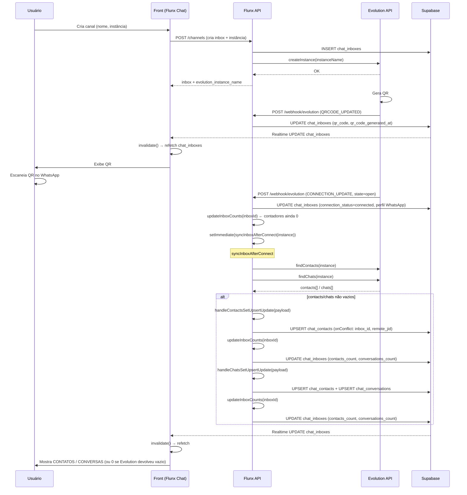
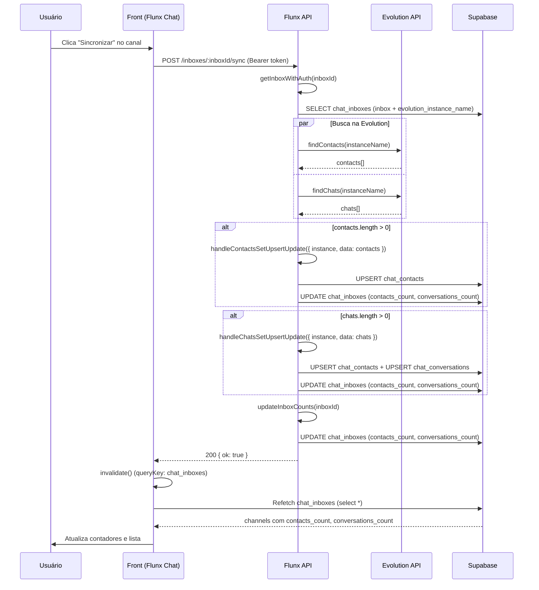
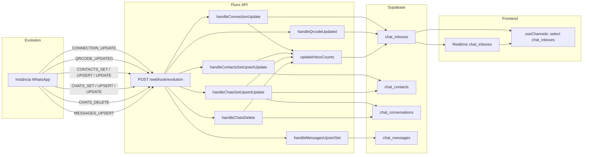
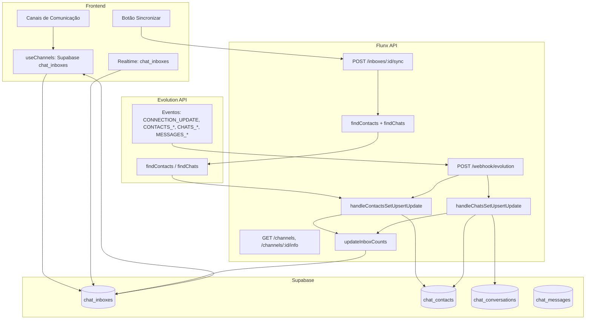

# Fluxo de eventos: Front → API → Evolution → Supabase

Visão da ordem dos eventos entre **Frontend (Flunx Chat)**, **API (Flunx API)**, **Evolution API** e **Supabase** para canais, contatos e conversas.

---

## 1. Criação do canal e conexão (QR / Conectado)

---

## 2. Botão "Sincronizar" no painel (manual)

---

## 3. Webhooks Evolution → API (automático)

A Evolution chama a API em **POST /webhook/evolution** quando algo muda na instância. A API persiste no Supabase; o front lê do Supabase (e Realtime atualiza a UI).

---

## 4. Onde os contadores (CONTATOS / CONVERSAS) são preenchidos

| Origem | O que acontece |
|--------|-----------------|
| **chat_inboxes.contacts_count** | `updateInboxCounts(inboxId)` faz `COUNT(*)` em `chat_contacts` onde `inbox_id = inboxId` e grava em `chat_inboxes`. |
| **chat_inboxes.conversations_count** | Mesmo `updateInboxCounts`: `COUNT(*)` em `chat_conversations` onde `inbox_id = inboxId`. |
| **Quando updateInboxCounts é chamado** | (1) Após `CONNECTION_UPDATE` (open); (2) Após `handleContactsSetUpsertUpdate`; (3) Após `handleChatsSetUpsertUpdate`; (4) Após `handleChatsDelete`; (5) No final de `POST /inboxes/:id/sync`. |
| **Frontend** | Lê `chat_inboxes` do Supabase (`useChannels` → `select *`). Exibe `channel.contacts_count` e `channel.conversations_count`. Atualiza via Realtime (UPDATE em `chat_inboxes`) ou após `invalidate()` (ex.: depois do Sync). |

---

## 5. Por que pode ficar 0 mesmo após "Sincronizar" ou nova instância

1. **Evolution devolve vazio**  
   `findContacts` e `findChats` retornam `[]`. Não há nada para upsert → contadores continuam 0.

2. **Webhook da Evolution não apontando para a API**  
   Se a Evolution não estiver configurada com a URL da flunx-api (ex.: `WEBHOOK_PUBLIC_URL/webhook/evolution`), eventos como `CONNECTION_UPDATE`, `CONTACTS_SET`, `CHATS_SET` não chegam → só o Sync manual traz dados (e mesmo assim só se findContacts/findChats retornarem algo).

3. **Instância nova**  
   Até o WhatsApp/Evolution popular contatos/chats, as chamadas à Evolution podem retornar vazio; após usar o número e ter conversas, Sync ou webhooks passam a preencher contadores.

4. **Erro no upsert (já corrigido)**  
   Antes: falta de UNIQUE em `(inbox_id, remote_jid)` em `chat_contacts` ou colunas de perfil faltando geravam erro no upsert e os contadores não subiam. Com as migrations aplicadas, isso não deve mais ocorrer.

---

## 6. Resumo em fluxograma único (alto nível)

---

*Documento gerado a partir do código em flunx-api e flunx-chat. Atualizar se rotas ou handlers mudarem.*
