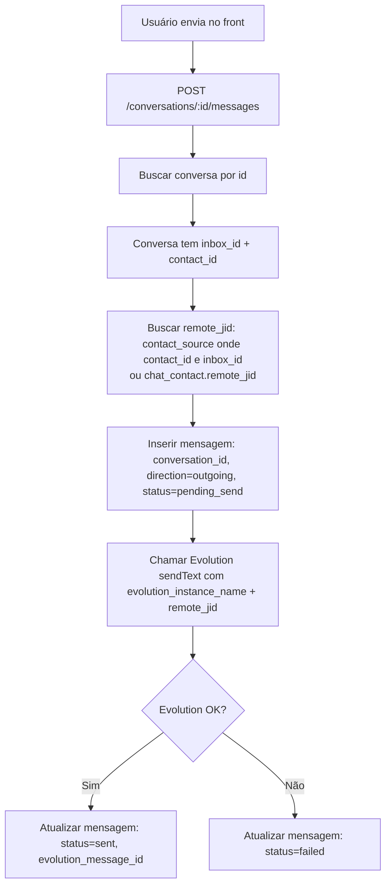
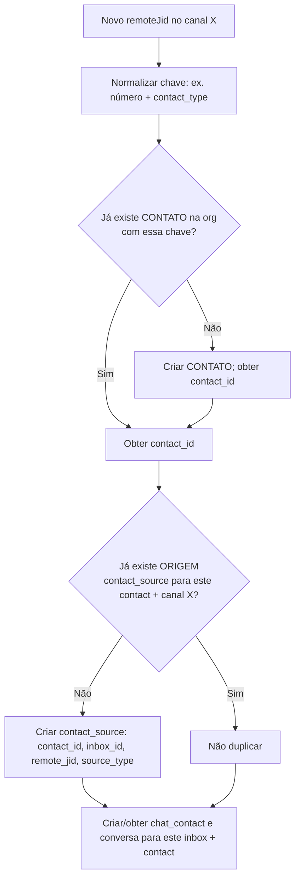
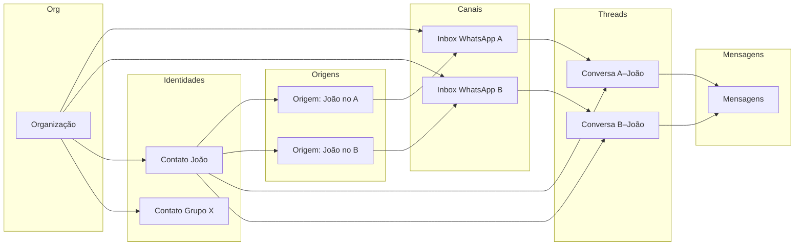

# Lógica e estratégia: sistema de chat profissional

**Objetivo:** Definir a lógica de um chat profissional (inspirado em WhatsApp, Telegram, Chatwoot) antes de implementar a Opção B (contatos unificados + origens). **Nenhuma implementação neste documento — apenas planejamento.**

---

## 1. Conceitos centrais (como em WhatsApp / Telegram / Chatwoot)

### 1.1 Organização (tenant)

- **O que é:** A empresa ou conta que usa o sistema (ex.: “Flunx”, “Loja X”).
- **Possui:** vários **canais**, vários **contatos**, várias **conversas**, várias **mensagens**.
- **No nosso sistema:** `organizations` (já existe). Todas as entidades de chat pertencem a uma organização.

### 1.2 Canal (inbox / instância)

- **O que é:** Uma **conexão** por onde entram e saem mensagens. Ex.: um número WhatsApp (Evolution), um bot Telegram, futuramente Google Chat, importação CSV.
- **Características:**
  - Tem identidade própria (número, nome do bot, etc.).
  - Tem estado: conectado / desconectado / erro.
  - **Não é** “lista de contatos”: é o “meio” por onde falamos.
- **No nosso sistema:** `chat_inboxes` (Evolution: `evolution_instance_name`, `connection_status`, QR, etc.).
- **Regra:** Ao **desconectar** ou remover um canal, **não** apagamos contatos nem “de onde vieram” (origem); apenas deixamos de receber/enviar por aquele canal.

### 1.3 Contato (identidade da pessoa ou grupo)

- **O que é:** A **identidade** de quem conversamos — uma pessoa (individual) ou um grupo (várias pessoas em um único “chat”).
- **Não é** “uma conversa”: é **quem** está do outro lado. A mesma pessoa pode falar conosco por **vários canais** (ex.: WhatsApp Loja e WhatsApp Suporte).
- **Identificação:**
  - **WhatsApp individual:** `remote_jid` (ex.: `5562999999999@s.whatsapp.net`); chave normalizada = número.
  - **WhatsApp grupo:** `remote_jid` (ex.: `120363123456789012@g.us`); chave = id do grupo.
  - **Google (futuro):** email ou id.
  - **Import (futuro):** id externo ou telefone/email.
- **Dados do contato:** nome, avatar, tipo (individual | group), etiquetas internas (nosso CRM), campos customizados.
- **Regra de deduplicação:** Um **único** contato por “identidade” na organização. Ex.: mesmo número em dois canais WhatsApp = **um** contato com **duas** origens (duas tags: canal A, canal B).

### 1.4 Origem do contato (contact source)

- **O que é:** **Onde** conhecemos esse contato — por qual canal ou fonte ele “entrou” na nossa base.
- **Exemplos:** “WhatsApp - Loja”, “WhatsApp - Suporte”, “Google Contatos”, “Importação CSV - jan/2026”.
- **Dados típicos:** tipo da fonte (whatsapp_inbox | google | import), referência (inbox_id, etc.), identificador naquela fonte (ex.: `remote_jid` no WhatsApp), label para exibição.
- **Regra:** Ao **desconectar** um canal, as origens daquele canal **permanecem** (não deletamos); assim mantemos “este contato veio do canal X” mesmo depois de X estar desconectado.

### 1.5 Conversa (thread / chat)

- **O que é:** **Uma** thread de mensagens com **um** contato **em um** canal. Ou seja: “conversa = contato + canal”.
- **WhatsApp/Telegram:** A lista “Conversas” mostra **conversas** (threads), não “todos os contatos”. Só aparece quem já trocou mensagem naquele contexto.
- **Regra:** Uma conversa = (canal, contato). O mesmo contato em dois canais = **duas conversas** (uma por canal).
- **Dados da conversa:** última mensagem (preview), data/hora da última atividade, status (aberta/fechada), etiquetas, opcional archive/pin.
- **Mensagens** pertencem a **uma** conversa.

### 1.6 Mensagem

- **O que é:** Uma única mensagem dentro de uma conversa.
- **Dados:** conteúdo, direção (entrada/saída), data/hora, status (enviada/entregue/lida/falha), em grupos: **quem enviou** (participant).
- **Regra:** Mensagem sempre vinculada a **uma** conversa; a conversa está vinculada a **um** canal e **um** contato.

---

## 2. Diferença Contato vs Conversa (resumo)

| Aspecto | Contato | Conversa |
|--------|---------|----------|
| **O que é** | Quem é a pessoa/grupo (identidade) | Uma thread de mensagens com esse contato **em um canal** |
| **Quantidade** | Um por “pessoa/grupo” na org (deduplicado) | Uma por (canal, contato) — mesmo contato em 2 canais = 2 conversas |
| **Onde aparece** | Página **Contatos** (lista de identidades + tags de origem) | Página **Chat** (lista de threads com atividade recente) |
| **Exemplo** | “João Silva” (pode ter origem WhatsApp Loja + WhatsApp Suporte) | “Conversa com João no canal Loja” e “Conversa com João no canal Suporte” |

- **Contato** = identidade; pode ter várias **origens** (canais/fontes).
- **Conversa** = canal + contato; é o que aparece na “lista de chats” e onde as mensagens vivem.

---

## 3. Fluxos principais (fluxogramas)

### 3.1 Mensagem recebida (webhook Evolution → nosso sistema)

```mermaid
flowchart TD
    A[Evolution envia POST /webhook/evolution] --> B[Extrair instance, remoteJid, participant, conteúdo]
    B --> C[instance → inbox_id no chat_inboxes]
    C --> D{Contato já existe na org?<br/>buscar por normalized(remoteJid) + contact_type}
    D -->|Não| E[Criar CONTATO org-level<br/>normalized_phone ou remote_jid, name, contact_type]
    D -->|Sim| F[Usar contact_id existente]
    E --> G[Criar ou atualizar ORIGEM<br/>contact_source: contact_id, inbox_id, remote_jid]
    F --> G
    G --> H{Chat_contact existe<br/>para este inbox + contact?}
    H -->|Não| I[Criar chat_contact: inbox_id, contact_id, remote_jid]
    H -->|Sim| J[Usar chat_contact existente]
    I --> K[Conversa existe? inbox_id + contact_id]
    J --> K
    K -->|Não| L[Criar conversa: inbox_id, contact_id]
    K -->|Sim| M[Usar conversa existente]
    L --> N[Inserir mensagem: conversation_id, content, direction, participant_remote_jid, created_at]
    M --> N
    N --> O[Responder 200 ao webhook]
```

**Resumo:** Webhook identifica o canal (inbox); resolve ou cria **contato** (org); garante **origem** (contact_source) para aquele inbox; garante **chat_contact** e **conversa** (inbox + contato); insere **mensagem** na conversa.

### 3.2 Mensagem enviada (usuário → API → Evolution)



**Resumo:** Envio sempre por **uma conversa** (que já tem canal + contato); o `remote_jid` para envio vem da **origem** ou do vínculo inbox+contato (chat_contact).

### 3.3 Listar conversas (página Chat)

```mermaid
flowchart TD
    A[GET /inboxes/:inboxId/conversations] --> B[Filtrar por inbox_id]
    B --> C[Ordenar por última atividade / updated_at]
    C --> D[Retornar conversas com: contact (nome, avatar, contact_type), preview, updated_at]
    D --> E[Front: exibir só CONVERSAS com atividade<br/>opcional: only_with_messages=true]
```

**Regra:** Na página **Chat** entram apenas **conversas** (threads com mensagens, ou com última atividade). **Não** listar “todos os contatos” como se fossem conversas.

### 3.4 Listar contatos (página Contatos)

```mermaid
flowchart TD
    A[GET /contacts — org do JWT] --> B[Listar CONTATOS org-level]
    B --> C[Para cada contato: buscar ORIGENS contact_sources]
    C --> D[Retornar: id, name, avatar, contact_type, sources: [{ inbox_name, source_type }] ]
    D --> E[Front: exibir contatos com tags por origem]
```

**Regra:** Na página **Contatos** entram **contatos** (identidades), cada um com **tags de origem** (em quais canais/fontes ele aparece). Não depende de “ter conversa aberta”.

### 3.5 Inclusão de contato (sync ou webhook) — não duplicar



**Resumo:** Contato é **único** por identidade na org; **origem** é única por (contato, canal). Assim não duplicamos contato ao aparecer em outro canal; apenas adicionamos uma nova origem/tag.

---

## 4. Modelo de dados (Opção B — resumo lógico)

- **organizations** — já existe.
- **chat_inboxes** — canais (Evolution, futuramente outros). Não deletar contatos ao desconectar; no máximo SET NULL em FKs se necessário, ou não usar CASCADE.
- **contacts** (novo, org-level): id, organization_id, normalized_phone, email, name, avatar_url, contact_type (individual | group), created_at, updated_at. Uma linha por “pessoa/grupo”.
- **contact_sources**: id, contact_id, source_type (whatsapp_inbox | google | import), source_ref (ex.: inbox_id), label, remote_jid (para WhatsApp), created_at. Uma linha por (contato, canal/fonte). **Ao desconectar canal:** não apagar; origem permanece.
- **chat_contacts** (papel de “vínculo inbox–contato” para conversas): id, inbox_id, contact_id (FK contacts), remote_jid, name, avatar_url (cache por canal), contact_type. Usado para resolver “conversa no canal X com o contato Y” e enviar mensagem (remote_jid).
- **chat_conversations**: id, inbox_id, contact_id (FK contacts ou chat_contacts conforme modelo escolhido), status, labels, updated_at, etc. Uma conversa = (inbox, contact).
- **chat_messages**: id, conversation_id, content, direction, participant_remote_jid (grupos), created_at, status, evolution_message_id.

**Painel do contato (notas, propostas, agendamentos, lembretes):** referenciar **contacts.id** (um painel por identidade), não por chat_contact, para que seja único mesmo com vários canais.

---

## 5. Estratégia de implementação (Opção B) — ordem sugerida

1. **Schema:** Criar tabelas `contacts` e `contact_sources`; adicionar `contact_id` em `chat_contacts` (FK para `contacts`); migrar notas/propostas/agendamentos/lembretes para `contact_id` (contacts).
2. **Webhook + Sync:** Ao receber mensagem ou ao sincronizar: resolver/criar **contact** por (org, chave normalizada); criar **contact_source** e **chat_contact**; criar conversa e mensagem. Nunca duplicar contato; só adicionar origem se novo canal.
3. **APIs:** `GET /contacts` (org) retornando contatos com `sources[]`; manter `GET /inboxes/:id/conversations` baseado em conversas (inbox + contact); envio de mensagem usando remote_jid da origem/chat_contact.
4. **Frontend:** Página **Contatos** única (todos os canais), com tags de origem. Página **Chat** apenas conversas (threads com atividade). Painel do contato atrelado a **contact** (identidade).
5. **Desconexão de canal:** Não deletar `contact_sources` nem `contacts`; apenas atualizar status do inbox. Opcional: marcar origem como “inativo” se quiser filtrar no futuro.

---

## 6. Fluxograma geral (visão de entidades)



---

## 7. Referências

- [Evolution API — Webhooks](https://doc.evolution-api.com/v2/en/configuration/webhooks)
- [Chatwoot — Data model](https://www.chatwoot.com/docs/product/others/data-model) (conversations, contacts, messages)
- Documento interno: `CONTATOS-UNIFICADOS-PLANO.md` (Opção A vs B)
- Documento interno: `PLANO-CONVERSAS-UX-E-GRUPOS.md` (conversas, grupos, identidade)

---

**Última atualização:** 2 de fevereiro de 2026  
**Status:** Planejamento apenas; implementação Opção B a ser executada em fases após validação deste desenho.
